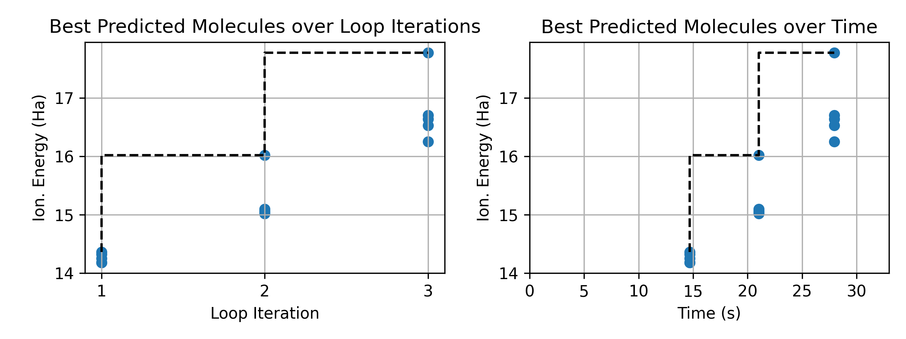

## Task 1: Active Learning Optimization

Experimental Results (Baseline vs. Optimized)

Compare the default configuration against a tuned configuration running on a Polaris node.

| Metric | **Default Configuration** | **Optimized Configuration** | **Impact** |
| :--- | :--- | :--- | :--- |
| **Batch Size** | 4 | **64** | **16x Throughput** |
| **Max Samples** | 24 | **200** | **~8x Search Depth** |
| **Wall Clock Time** | 24.69 s | 32.97 s | Similar Time Cost |
| **Best Energy Found** | **15.33 Ha** | **17.78 Ha** | **+2.45 Ha (Success)**

Code Modifications
The following parameters were modified in `3_ml_in_the_loop.py` to achieve these results:

```python
# Modified parameters for high-throughput active learning
initial_training_count = 16   # Increased from 8 to improve initial model quality
max_training_count = 200      # Increased from 24 to allow convergence on high-energy targets
batch_size = 64               # Increased from 4 to saturate Polaris CPU cores
```


## Task 2: Data Transfer Performance (Parsl vs. DragonHPC)

Compare the performance of Parsl and DragonHPC when scaling both the compute resources (Node count) and the data intensity (Grid size).

### 1. Experimental Results

| Implementation | Config (Nodes / Sims / Grid) | Data Size (GB) | Sim Run / IO Time (s) | Train Run / IO Time (s) |
| :--- | :--- | :--- | :--- | :--- |
| **Parsl + Futures** | 1 Node / 64 / 512 | 1.25 GB | 19.62 / NA | 49.22 / NA |
| **Parsl + Filesystem**| 1 Node / 64 / 512 | 1.25 GB | 16.42 / 0.09 | 15.60 / 0.48 |
| **Dragon + DDict** | 1 Node / 64 / 512 | 1.25 GB | **11.86** / 0.07 | 21.84 / 1.39 |
| | | | | |
| **Parsl + Futures** | 2 Nodes / 64 / 512 | 1.25 GB | 14.49 / NA | 75.60 / NA |
| **Parsl + Filesystem**| 2 Nodes / 64 / 512 | 1.25 GB | 12.40 / 0.11 | 34.50 / 2.15 |
| **Dragon + DDict** | 2 Nodes / 64 / 512 | 1.25 GB | **6.84** / 0.19 | 28.46 / 1.73 |
| | | | | |
| **Parsl + Futures** | 2 Nodes / 64 / 1024 | **5.00 GB** | 22.69 / NA | **349.29** / NA |
| **Parsl + Filesystem**| 2 Nodes / 64 / 1024 | 5.00 GB | 12.05 / 0.42 | 56.00 / 6.29 |
| **Dragon + DDict** | 2 Nodes / 64 / 1024 | 5.00 GB | **8.08** / 0.79 | 64.41 / **3.97** |

### 2. Key Observations

**1. Data Scaling Stress Test (Run 2 vs Run 3)**
* **Parsl + Futures Breakdown:** When increasing the data size to 5 GB, the **Parsl + Futures** training time exploded to **~349 seconds** (compared to ~75s for the smaller dataset). This confirms that serializing large Python objects (pickling) and streaming them through the manager process creates a massive bottleneck, making this method unsuitable for data-intensive workflows.
* **I/O Efficiency (Filesystem vs. Dragon):** In the large data run, **DragonHPC** demonstrated superior I/O performance. Its training I/O time was **3.97s**, nearly 40% faster than the **Parsl + Filesystem** approach (6.29s). This illustrates the advantage of Dragon's distributed dictionary (DDict), which keeps data in shared memory across nodes to avoid the latency and locking associated with parallel file systems.

**2. Simulation Speed**
* **DragonHPC** consistently achieved the fastest simulation run times across all configurations (e.g., **6.84s** on 2 nodes vs **12.40s** for Parsl FS). This suggests that Dragon's method of storing results directly into the distributed dictionary incurs less overhead than writing files to disk or passing future objects back to the manager.

**Conclusion:**
For small data, all methods are viable, though Parsl + Filesystem offers a good balance of simplicity and speed. However, as data scales up (GBs), **DragonHPC** becomes the optimal choice due to its efficient memory-based data transfer. **Parsl + Futures** should be strictly avoided for large data payloads due to severe serialization penalties.
